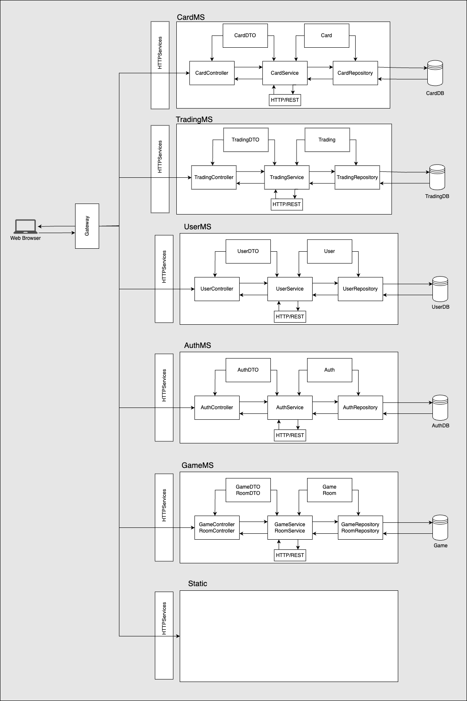

# ATELIER 3 - GROUPE 6

Lien vers le repository GitHub :
https://github.com/MaaatGrv/asi3_gr6

## Membres du groupe :
- Chloe Baillivet
- Souad Gouriach
- Mathis Gorvien

## Schémtisation de l'architecture :

## Réalisations

#### MicroServices

- Transformation de l'application existante en architecture Microservices
- Création de plusieurs microservices (AuthMS, UserMS, CardMS, TradingMS, GameMS, Static et Gateway) en utilisant Spring Boot

#### Tests Unitaires

- Mise en place d'une politique de tests unitaires avec JUnit et Mockito pour les services Web et les programmes Java (non fonctionnels avec Docker)

#### Nouvelles Fonctionnalités

- Ajout de la fonctionnalité "Création de Room"
- Ajout de la fonctionnalité "Participation à une Room"
- Implémentation du jeu de carte (jeu en tour par tour avec un système d'impacts basé sur la puissance des cartes, les affinités élémentaires, et une partie aléatoire)
- Ajout de la fonctionnalité de gain et de retrait d'énergie pour les cartes après chaque jeu
- Mise à jour des crédits de l'utilisateur après chaque jeu
- Waiting screen pour attendre que tous les joueurs soient prêts
- Affichage de la liste des joueurs dans la room
- Mise en place d'une passerelle API (Gateway) pour acheminer les requêtes aux services appropriés en utilisant Spring Cloud Gateway
- Mise en place du Static Service pour servir les fichiers statiques (HTML, CSS, JS, images, etc.).

#### Bonus

- Conteneurisation de chaque micro-service avec Docker
- Configuration d'un serveur de répartition de charge avec Nginx pour distribuer les requêtes entrantes

## Éléments non-réalisés du cahier des charges

- Plan de tests de non-régression 
- Utilisation de SonarQube pour l'analyse de la qualité du code (non disponible pour macOS)

## Éléments réalisés en plus du cahier des charges

- Utilisation de Docker Compose pour orchestrer les conteneurs Docker
- Debugging et résolution des problèmes de communication entre services et entre les services et la passerelle API

## Comment exécuter le projet

1. Assurez-vous que Docker et Docker Compose sont installés sur votre machine.
2. Clonez le répertoire du projet : `git clone https://github.com/MaaatGrv/asi3_gr6`.
3. Naviguez jusqu'au dossier racine du projet.
4. Exécutez `docker-compose up` pour lancer tous les services.
5. L'application est maintenant accessible à l'adresse `http://localhost:8090/login.html`.

## Tests

Pour exécuter les tests unitaires de chaque service, naviguez jusqu'au dossier du service et exécutez la commande `./mvnw test`.

## Problèmes connus et solutions

### Bug d'affichage lors de la game
- Les noms des joueurs peuvent être inversés lors de la game. Cela est dû à un problème de javascript non résolu. Pas de solution pour le moment.

### Sélection des cartes dans les listes
- Il faut faire attention à bien sélectionner les cartes dans les listes. En effet, si on clique sur l'icone pour acheter ou vendre, la carte ne sera pas sélectionnée. Il faut cliquer sur la colonne de la carte elle-même puis acheter ou vendre. Indic : il faut que l'affichage sur la droite soit correctement mis à jour.

## Futurs travaux

- Présentation de l'architecture technique de l'application ainsi qu'un plan de tests de non-régression dans un rapport pour les clients.
- Amélioration de la couverture des tests.
- Optimisation de la performance des services.
- Ajout de nouvelles fonctionnalités et amélioration des fonctionnalités existantes.